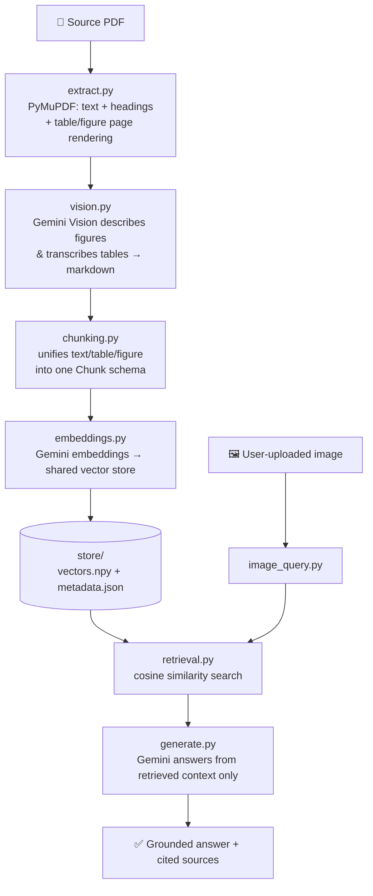

<div align="center">

# 🧠 Multimodal RAG — *"Attention Is All You Need"*

**A retrieval-augmented generation chatbot that reads a research paper the way a human does — text, tables, *and* figures — and answers questions grounded strictly in what it retrieves.**

[](https://www.python.org/)
[](https://fastapi.tiangolo.com/)
[](https://ai.google.dev/)
[](#-license)
[](#)

[Overview](#-overview) • [Architecture](#-architecture) • [Setup](#-setup) • [Usage](#-usage) • [Web App](#-web-app) • [API](#-api-reference) • [Demo Queries](#-demo-queries) • [Notes](#-notes--limitations)

</div>

---

## 📖 Overview

This repo indexes the *"Attention Is All You Need"* paper (the paper that introduced the Transformer) across **three modalities**:

| Modality | Source | How it's captured |
|---|---|---|
| 📝 **Body text** | Paper sections | PyMuPDF text extraction + font-size heading detection |
| 📊 **Tables** | Table pages (e.g. BLEU score comparisons) | Rendered to PNG, transcribed to markdown by Gemini Vision |
| 🖼️ **Figures** | Architecture diagram, attention-visualization plots | Raster images extracted directly, or vector pages rendered to PNG, then described by Gemini Vision |

All of it lands in **one shared embedding space**, so a single query can pull back a mix of text, table, and figure context — and the model is instructed to answer using *only* that retrieved context. There's both a **CLI pipeline** and a **FastAPI + web frontend** for asking questions interactively, including uploading your own image.

---

## 🏗️ Architecture



**Design decisions:**

- **Tables as images, not text extraction** — this specific arXiv PDF has a broken text layer on table pages (confirmed via testing; standard extractors return garbled, space-less text). Table pages are rendered as images and transcribed by Gemini Vision instead.
- **Figures, two paths** — Figures 1–2 are embedded raster images and are extracted directly. Figures 3–5 (attention-visualization plots) are vector drawings with no embedded raster, so their pages are rendered to PNG and fed through the same vision-description step.
- **One shared vector space** — every chunk, regardless of modality, is embedded by the same model, so retrieval doesn't need to know in advance what kind of content will answer a query.

---

## 🧰 Tech Stack

| Layer | Tools |
|---|---|
| PDF parsing | `PyMuPDF`, `pdfplumber` |
| Vision & generation | Gemini (`gemini-3.1-flash-lite`) |
| Embeddings | Gemini (`gemini-embedding-001`, 768-dim) |
| Vector store | In-memory NumPy matrix + cosine similarity |
| Backend | FastAPI, Uvicorn |
| Frontend | HTML / CSS / vanilla JS |

---

## 📁 Project Structure

```
Multimodal-Rag-ChatBot/
├── backend/            FastAPI app — /api/query, /api/image-query, static file serving
├── frontend/            index.html, app.js, style.css — the chat UI
├── data/                drop the source PDF here
├── sample_outputs/       example demo runs
├── extract.py           PDF → text / table-pngs / figure-pngs
├── vision.py            Gemini Vision descriptions & table transcription
├── chunking.py          unifies everything into one Chunk schema
├── embeddings.py         builds the shared vector store
├── retrieval.py         cosine-similarity search over the store
├── generate.py           grounded answer generation
├── image_query.py         ask a question using an uploaded image
├── config.py             models, paths, API key loading
├── main.py               CLI entrypoint / orchestrator
├── requirements.txt
└── .env.example
```

---

## ⚙️ Setup

<details open>
<summary><b>1. Clone & create a virtual environment</b></summary>

```bash
git clone https://github.com/mk-2007/Multimodal-Rag-ChatBot.git
cd Multimodal-Rag-ChatBot

python3 -m venv venv
source venv/bin/activate        # Windows: venv\Scripts\activate
```
</details>

<details open>
<summary><b>2. Install dependencies</b></summary>

```bash
pip install -r requirements.txt
```
</details>

<details open>
<summary><b>3. Provide a Gemini API key</b></summary>

Get one at [ai.google.dev](https://ai.google.dev/gemini-api/docs/api-key), then either:

```bash
# (a) plain environment variable
export GEMINI_API_KEY="your-key-here"
```

```bash
# (b) or copy the template and fill it in — auto-loaded via python-dotenv
cp .env.example .env && nano .env
```

The key is never hardcoded — `config.py` only ever reads it from the environment. `.env` is gitignored.
</details>

<details open>
<summary><b>4. Add the source PDF</b></summary>

Drop the paper into `data/` (any single `.pdf` there is picked up automatically), e.g. `data/1706_03762v7.pdf` — **or** point to it anywhere on disk:

```bash
export PDF_PATH=/path/to/1706_03762v7.pdf
```

The PDF itself isn't shipped in this repo — you provide it.
</details>

---

## 🚀 Usage

### CLI pipeline

```bash
# Full pipeline: extract → vision → chunk → embed → demo queries
python3 main.py

# Reuse an already-built vector store, just re-run the demo queries
python3 main.py --skip-build

# Ask your own question after building
python3 main.py --query "What optimizer and learning rate schedule was used?"
```

Each stage can also be run individually:

```bash
python3 extract.py      # → data/extracted_content.json, images/*.png
python3 vision.py       # → data/extracted_content_with_vision.json
python3 chunking.py     # → data/chunks.json
python3 embeddings.py   # → store/vectors.npy, store/metadata.json
python3 retrieval.py "What is multi-head attention?"
python3 generate.py     # demo single Q&A
```

### 💻 Web App

Once the vector store is built, spin up the interactive chat UI:

```bash
uvicorn backend.app:app --reload
```

Then open **http://127.0.0.1:8000** — you can type a question, or upload an image and ask about it directly.

---

## 🔌 API Reference

The FastAPI backend is a thin layer over the pipeline modules — no RAG logic lives here.

| Method | Endpoint | Description |
|---|---|---|
| `POST` | `/api/query` | Body: `{"query": "..."}` → grounded answer + retrieved source chunks |
| `POST` | `/api/image-query` | Multipart: `file` (image) + optional `question` → answer grounded in the image + retrieved context |
| `GET` | `/api/status` | `{"ready": bool, "error": str \| null}` — whether the vector store is loaded |
| `GET` | `/api/asset/{filename}` | Serves an extracted figure/table image referenced in a result |

<details>
<summary><b>Example response shape</b></summary>

```json
{
  "answer": "...",
  "sources": [
    {
      "score": 0.83,
      "chunk_id": "fig-1",
      "modality": "figure",
      "page": 3,
      "heading_context": "3.1 Encoder and Decoder Stacks",
      "content": "...",
      "source_ref": "Figure 1",
      "image_url": "/api/asset/figure_1.png"
    }
  ]
}
```
</details>

---

## 🔍 Demo Queries

One per modality, so you can see the retrieval actually switching context types:

1. **📊 Table-grounded** — *"BLEU scores for Transformer (big) vs GNMT+RL"* → pulls from the vision-transcribed Table 2 chunk.
2. **🖼️ Figure-grounded** — *"Describe the encoder-decoder architecture"* → pulls from the vision-described Figure 1 chunk.
3. **📝 Text-grounded** — *"What is multi-head attention?"* → pulls from body-text chunks in Section 3.2.2.

## 📤 Outputs

| Path | Contents |
|---|---|
| `output/demo_results.json` | Full query + retrieved context + answer log |
| `output/demo_results.md` | Same, formatted for human reading |
| `images/` | Extracted figure PNGs + rendered table-page PNGs |
| `store/` | The shared embedding matrix + chunk metadata |

---

## 📝 Notes / Limitations

- `gemini-embedding-001` (768-dim) handles embeddings; `gemini-3.1-flash-lite` handles both vision description and grounded generation — swap either in `config.py`.
- The vector store is a plain in-memory NumPy matrix with cosine similarity — fine at this paper's scale (a few dozen chunks). Swap in FAISS / Chroma / pgvector for larger corpora.
- Vision calls are cached in `data/vision_cache.json`, so re-running the pipeline doesn't re-spend API calls on unchanged images.

---

## 👤 Author

**Mahandar** — BSCS student, FAST-NUCES Karachi
[GitHub @mk-2007](https://github.com/mk-2007) · [Codeforces @_gazzy284](https://codeforces.com/profile/_gazzy284)

